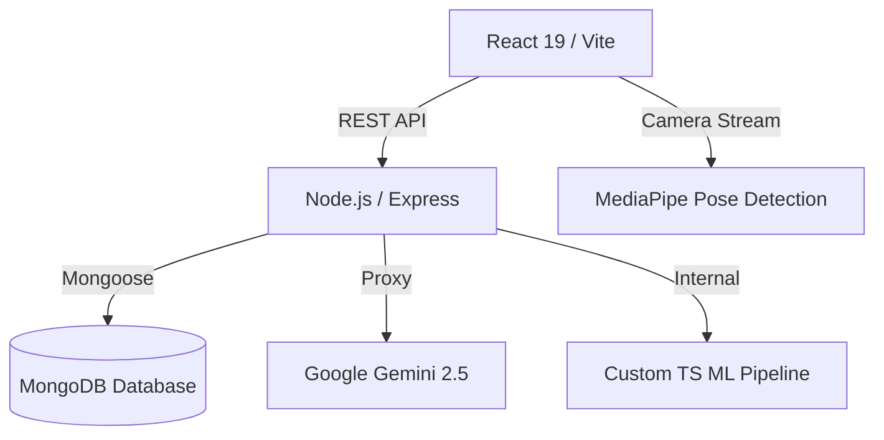

<div align="center">
  
  <h1 align="center">FlexAI - Neural Fitness Ecosystem</h1>

  <p align="center">
    A full-stack, AI-powered fitness ecosystem bridging the gap between human physiology and machine learning.
    <br />
    <a href="#features"><strong>Explore the docs »</strong></a>
    <br />
    <br />
    <a href="#">View Demo</a>
    ·
    <a href="#">Report Bug</a>
    ·
    <a href="#">Request Feature</a>
  </p>
</div>

---

## 🚀 Project Overview

FlexAI solves the fragmentation in the modern fitness industry. Instead of relying on disparate applications for diet tracking, form correction, and workout logging, FlexAI acts as a unified "Neural Link". 

Designed as a premium portfolio piece, it leverages **React 19**, **Node.js/Express**, and **MongoDB**, augmented by **Google Gemini 2.5 Flash** for nutritional analysis and custom **Linear Regression** pipelines for predictive metabolic analytics.

---

## ✨ Features Showcase

- 🛡️ **JWT Secured Authentication**: Cryptographically signed sessions with Bcrypt hashing.
- 📸 **Gemini 2.5 Food Scanner**: Zero-shot image classification extracts macros and provides a "Health Grade" from raw meal photos.
- 🤖 **Predictive Metabolic Engine**: Custom TypeScript linear regression pipeline predicts localized energy expenditure based on live biometric telemetry.
- 🧘 **Neural Posture AI**: Real-time MediaPipe computer vision analyzes skeletal movement to eliminate technical failures.
- 📊 **Evolution Tracking**: Responsive recharts map skeletal mass delta and volume efficiency over holographic timelines.
- 🎨 **Premium Aesthetics**: High-impact "Cyber/Neural" dark mode built with Tailwind CSS v4, Framer Motion, and Shadcn UI.

---

## 🏗️ Architecture



---

## 💻 Local Setup & Installation

### Prerequisites
- [Node.js](https://nodejs.org/) (v18 or higher recommended)
- [MongoDB](https://www.mongodb.com/) (Local or Atlas cluster)
- Google AI Studio API Key (for Gemini)

### Installation

1. **Clone the repository:**
   ```bash
   git clone https://github.com/yourusername/flexai.git
   cd flexai
   ```

2. **Install dependencies:**
   ```bash
   npm install
   ```

3. **Configure Environment Variables:**
   Create a `.env` file in the root directory:
   ```env
   PORT=3000
   MONGODB_URI=your_mongodb_connection_string
   GEMINI_API_KEY=your_google_gemini_key
   JWT_SECRET=your_secure_random_string
   ```

4. **Start the Development Server:**
   ```bash
   npm run dev
   ```
   > The platform will be available at `http://localhost:3000`.

---

## 🧠 Machine Learning Workflow

FlexAI features a dual-engine architecture:

### 1. Generative AI (Gemini Flash)
- **Use Case:** Diet synthesis.
- **Workflow:** A user uploads an image via the React frontend. Multer processes the image in memory. The Node server passes the base64 buffer and a strict JSON-schema prompt to Gemini. The AI returns exact macronutrients and grades.

### 2. Statistical Learning (Linear Regression)
- **Use Case:** Predictive calorie modeling.
- **Workflow:** 
  1. **Dataset Upload:** User uploads a CSV dataset to `/api/ml/dataset` (e.g., `weight`, `duration`, `calories_burned`).
  2. **Training Phase:** Triggering `/api/ml/train` spawns a child process executing `ml/train.ts`. The script parses the CSV, trains a linear regression model, evaluates `R2` score, and saves weights to `model.json`.
  3. **Inference:** Live biometrics query `/api/ml/predict` to receive accurate calorie predictions based on the persisted model weights.

---

## 📱 Screenshots

| Landing Page (Interactive Demo) | Live Dashboard (Evolution Tracking) |
| --- | --- |
|  |  |

*(Note: Replace placeholder images with actual UI screenshots before public release.)*

---

## 🚢 Deployment Guide

1. **Build the Application:**
   ```bash
   # Builds both Vite frontend and ESBuild backend
   npm run build
   npm run build:server
   ```
2. **Production Execution:**
   ```bash
   NODE_ENV=production npm start
   ```
3. **Hosting:**
   - **Backend/Fullstack:** Deploy the repository to Render, Heroku, or an AWS EC2 instance. Ensure the `dist` folder is generated and environment variables are set in the host dashboard.
   - **Database:** MongoDB Atlas is highly recommended for production deployment.

---

## 📚 API Documentation

For full API endpoint documentation, request payload examples, and responses, please refer to [API_DOCS.md](./API_DOCS.md).

---

## 🛡️ Security Implementations
- `helmet` applied for securing HTTP headers.
- `express-rate-limit` implemented on ML and Auth endpoints to prevent brute-force and DDoS attacks.
- `zod` input schema validation.
- Centralized global error handling ensuring no stack traces leak to the client.

---

*FlexAI - Engineered for absolute performance.*
